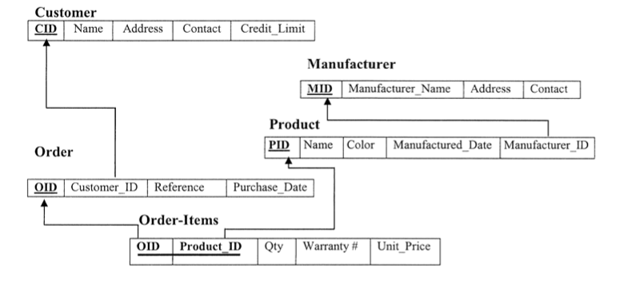
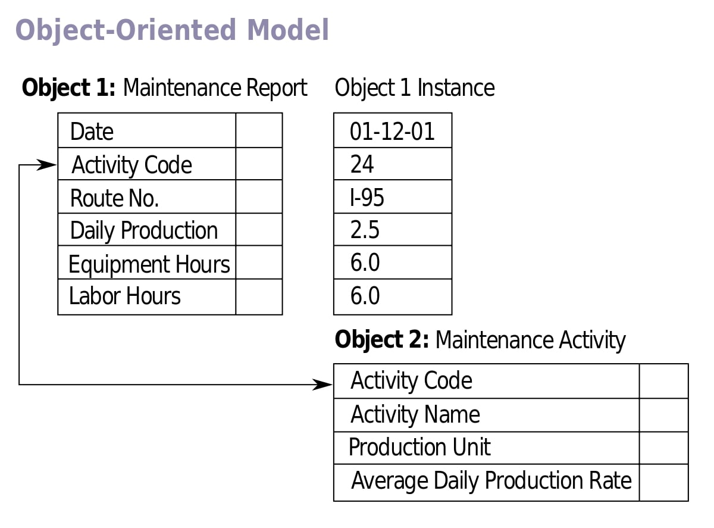
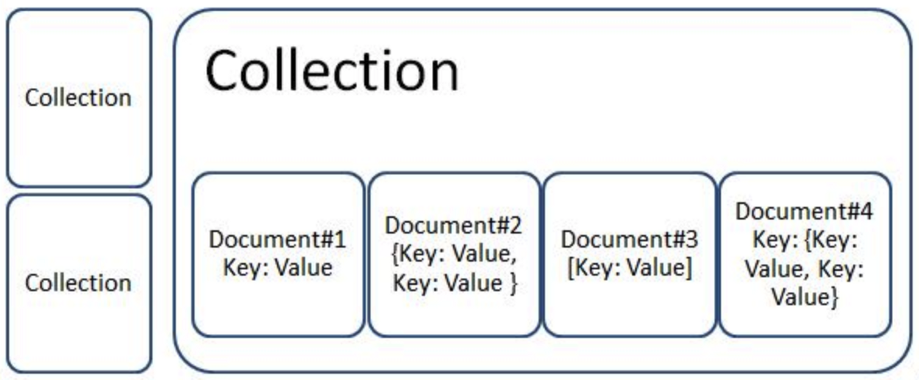
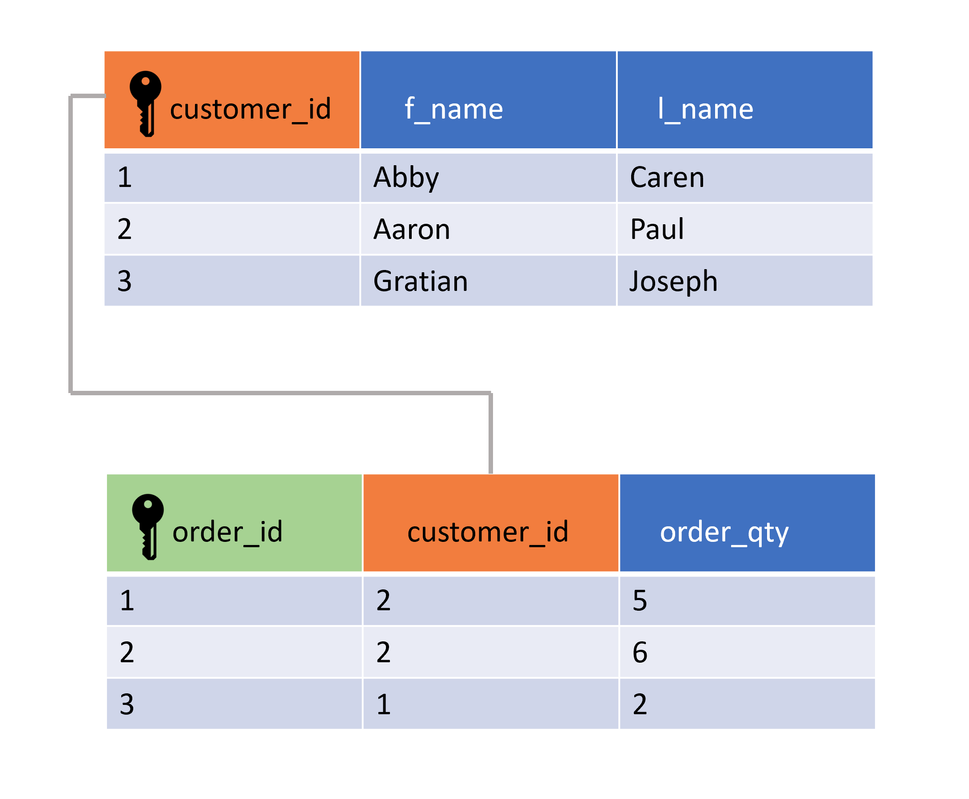
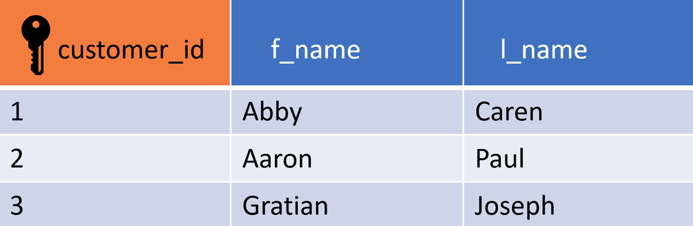

# Lecture 10

## Databases

A database is an organized collection of structured information. A database is usually controlled by a database
management system (DBMS).

### Database types

- Hierarchical


- Network


- Relational



- Object-oriented



- Graph


- Document



### ACID

- Atomicity
- Consistency
- Isolation
- Durability

**Atomicity** means that you either:

- Commit to the entirety of the transaction occurring
- Have no transaction at all

Essentially, an atomic transaction ensures that any commit you make finishes the entire operation successfully. Or, in
cases of a lost connection in the middle of an operation, the database is rolled back to its state prior to the commit
being initiated.

**Consistency** refers to maintaining data integrity constraints.

A consistent transaction will not violate integrity constraints placed on the data by the database rules. Enforcing
consistency ensures that if a database enters into an illegal state (if a violation of data integrity constraints
occurs) the process will be aborted and changes rolled back to their previous, legal state. Another way of ensuring
consistency within a database throughout each transaction is by also enforcing declarative constraints placed on the
database.

**Isolated** transactions are considered to be “serializable”, meaning each transaction happens in a distinct order
without any transactions occurring in tandem.

Any reads or writes performed on the database will not be impacted by other reads and writes of separate transactions
occurring on the same database. A global order is created with each transaction queueing up in line to ensure that the
transactions complete in their entirety before another one begins.

Importantly, this doesn’t mean two operations can’t happen at the same time. Multiple transactions can occur as long as
those transactions have no possibility of impacting the other transactions occurring at the same time.

**Durability** ensures that changes made to the database (transactions) that are successfully committed will survive
permanently, even in the case of system failures.

## SQL

SQL is a programming language used by nearly all relational databases to query, manipulate, and define data, and to
provide access control. SQL was first developed at IBM in the 1970s. In the late 1970s, Relational Software, Inc. (now
Oracle Corporation) saw the potential of the SQL and developed their own SQL-based RDBMS.

### Manipulation

#### Column Constraints

Column constraints are the rules applied to the values of individual columns:

- `PRIMARY KEY` constraint can be used to uniquely identify the row.
- `UNIQUE` columns have a different value for every row.
- `NOT NULL` columns must have a value.
- `DEFAULT` assigns a default value for the column when no value is specified.

There can be only one PRIMARY KEY column per table and multiple `UNIQUE` columns.

```sql
CREATE TABLE student
(
    id    INT PRIMARY KEY,
    name  INT UNIQUE,
    grade INT NOT NULL,
    age   INT DEFAULT 10
);
```

#### CREATE TABLE Statement

The `CREATE TABLE` statement creates a new table in a database. It allows one to specify the name of the table and the
name of each column in the table.

```sql
CREATE TABLE table_name
(
    column1 datatype,
    column2 datatype,
    column3 datatype
);
```

#### INSERT Statement

The `INSERT INTO` statement is used to add a new record (row) to a table.

It has two forms as shown:

- Insert into columns in order.
- Insert into columns by name.

```sql
-- Insert into columns in order:
INSERT INTO my_table
VALUES (value1, value2);

-- Insert into columns by name:
INSERT INTO my_table (column1, column2)
VALUES (value1, value2);

```

#### ALTER TABLE Statement

The `ALTER TABLE` statement is used to modify the columns of an existing table. When combined with the ADD COLUMN
clause, it is used to add a new column.

```sql
ALTER TABLE my_table
    ADD new_column datatype;
```

#### DELETE Statement

The DELETE statement is used to delete records (rows) in a table. The WHERE clause specifies which record or records
that should be deleted. If the WHERE clause is omitted, all records will be deleted.

```sql
DELETE
FROM my_table
WHERE some_column = some_value;
```

#### UPDATE Statement

The `UPDATE` statement is used to edit records (rows) in a table. It includes a SET clause that indicates the column to
edit and a `WHERE` clause for specifying the record(s).

```sql
UPDATE my_table
SET column1 = value1,
    column2 = value2
WHERE some_column = some_value;
```

### Queries

#### AND Operator

The `AND` operator allows multiple conditions to be combined. Records must match both conditions that are joined
by `AND` to be included in the result set. The given query will match any car that is blue and made after 2014.

```sql
SELECT model
FROM cars
WHERE color = 'blue'
  AND release_year > 2014;
```

#### AS Clause

Columns or tables can be aliased using the AS clause. This allows columns or tables to be specifically renamed in the
returned result set. The given query will return a result set with the column for `title` renamed to `movie_title`.

```sql
SELECT title AS 'movie_title'
FROM movies;
```

#### OR Operator

The `OR` operator allows multiple conditions to be combined. Records matching either condition joined by the `OR` are
included in the result set. The given query will match customers whose state is either 'CA' or 'NY'.

```sql
SELECT name
FROM customers
WHERE state = 'CA'
   OR state = 'NY';
```

#### SELECT Statement

The `SELECT *` statement returns all columns from the provided table in the result set. The given query will fetch all
columns and records (rows) from the movies table.

```sql
SELECT *
FROM movies;
```

#### LIKE Operator

The `LIKE` operator can be used inside of a `WHERE` clause to match a specified pattern. The given query will match any
movie that begins with Star in its title.

```sql
SELECT name
FROM movies
WHERE name LIKE 'Star%';
```

#### % Wildcard

The % wildcard can be used in a `LIKE` operator pattern to match zero or more unspecified character(s). The given query
will match any movie that begins with The, followed by zero or more of any characters.

```sql
SELECT name
FROM movies
WHERE name LIKE 'The%';
```

####         _ Wildcard

The _ wildcard can be used in a `LIKE` operator pattern to match any single unspecified character. The given query will
match any movie which begins with a single character, followed by ove.

```sql
SELECT name
FROM movies
WHERE name LIKE '_nception';
```

#### ORDER BY Clause

The `ORDER BY` clause can be used to sort the result set by a particular column either alphabetically or numerically. It
can be ordered in two ways:

- `DESC` is a keyword used to sort the results in descending order.
- `ASC` is a keyword used to sort the results in ascending order (default).

```sql
SELECT *
FROM contacts
ORDER BY birth_date DESC;
```

#### DISTINCT Clause

Unique values of a column can be selected using a DISTINCT query. For a table contact_details having five rows in which
the city column contains Chicago, Madison, Boston, Madison, and Denver, the given query would return
`Chicago, Madison, Boston, Denver`

```sql
SELECT DISTINCT city
FROM contact_details;
```

#### BETWEEN Operator

The `BETWEEN` operator can be used to filter by a range of values. The range of values can be text, numbers, or date
data. The given query will match any movie made between the years 1980 and 1990, inclusive.

```sql
SELECT *
FROM movies
WHERE year BETWEEN 1980 AND 1990;
```

#### LIMIT Clause

The `LIMIT` clause is used to narrow, or limit, a result set to the specified number of rows. The given query will limit
the result set to 5 rows.

```sql
SELECT *
FROM movies LIMIT 5;
```

#### NULL Values

Column values can be `NULL`, or have no value. These records can be matched (or not matched) using the `IS NULL`
and `IS NOT NULL` operators in combination with the WHERE clause. The given query will match all addresses where the
address has a value or is not `NULL`.

```sql
SELECT address
FROM records
WHERE address IS NOT NULL;
```

#### WHERE Clause

The `WHERE` clause is used to filter records (rows) that match a certain condition. The given query will select all
records where the `pub_year` equals `2017`.

```sql
SELECT title
FROM library
WHERE pub_year = 2017;
```

### Aggregate Functions

Aggregate functions perform a calculation on a set of values and return a single value:

- COUNT()
- SUM()
- MAX()
- MIN()
- AVG()

#### Column References

The GROUP BY and ORDER BY clauses can reference the selected columns by number in which they appear in the SELECT
statement. The example query will count the number of movies per rating, and will:

- GROUP BY column 2 (rating)
- ORDER BY column 1 (total_movies)

```sql
SELECT COUNT(*) AS 'total_movies', rating
FROM movies
GROUP BY 2
ORDER BY 1;
```

#### SUM() Aggregate Function

The SUM() aggregate function takes the name of a column as an argument and returns the sum of all the value in that
column.

```sql
SELECT SUM(salary)
FROM salary_disbursement;
```

#### MAX() Aggregate Function

The MAX() aggregate function takes the name of a column as an argument and returns the largest value in a column. The
given query will return the largest value from the amount column.

```sql
SELECT MAX(amount)
FROM transactions;
```

#### COUNT() Aggregate Function

The `COUNT()` aggregate function returns the total number of rows that match the specified criteria. For instance, to
find the total number of employees who have less than 5 years of experience, the given query can be used.

Note: A column name of the table can also be used instead of *. Unlike `COUNT(*)`, this variation `COUNT(column)` will
not count `NULL` values in that column.

```sql
SELECT COUNT(*)
FROM employees
WHERE experience < 5;
```

#### GROUP BY Clause

The GROUP BY clause will group records in a result set by identical values in one or more columns. It is often used in
combination with aggregate functions to query information of similar records. The GROUP BY clause can come after FROM or
WHERE but must come before any ORDER BY or LIMIT clause.

The given query will count the number of movies per rating.

```sql
SELECT rating,
       COUNT(*)
FROM movies
GROUP BY rating;
```

#### MIN() Aggregate Function

The MIN() aggregate function returns the smallest value in a column. For instance, to find the smallest value of the
amount column from the table named transactions, the given query can be used.

```sql
SELECT MIN(amount)
FROM transactions;
```

#### AVG() Aggregate Function

The AVG() aggregate function returns the average value in a column. For instance, to find the average salary for the
employees who have less than 5 years of experience, the given query can be used.

```sql
SELECT AVG(salary)
FROM employees
WHERE experience < 5;
```

#### HAVING Clause

The HAVING clause is used to further filter the result set groups provided by the GROUP BY clause. HAVING is often used
with aggregate functions to filter the result set groups based on an aggregate property. The given query will select
only the records (rows) from only years where more than 5 movies were released per year.

```sql
SELECT year,
    COUNT (*)
FROM movies
GROUP BY year
HAVING COUNT (*) > 5;
```

#### ROUND() Function

The ROUND() function will round a number value to a specified number of places. It takes two arguments: a number, and a
number of decimal places. It can be combined with other aggregate functions, as shown in the given query. This query
will calculate the average rating of movies from 2015, rounding to 2 decimal places.

```sql
SELECT year,
    ROUND(AVG (rating), 2)
FROM movies
WHERE year = 2015;
```

#### Operators
Operators

**Logical**:

- AND
- OR
- NOT

**Comparison**:

- <
- \>
- <=
- \>=
- =
- <> or !=

Math:

- +
- -
- *
- /
- %
- ^
- |/
- @


### Multiple Tables


#### Inner Join

The JOIN clause allows for the return of results from more than one table by joining them together with other results
based on common column values specified using an ON clause. INNER JOIN is the default JOIN and it will only return
results matching the condition specified by ON.

```sql
SELECT *
FROM books
JOIN authors
ON books.author_id = authors.id;
```

#### Outer Join

An outer join will combine rows from different tables even if the join condition is not met. In a LEFT JOIN, every row
in the left table is returned in the result set, and if the join condition is not met, then NULL values are used to fill
in the columns from the right table.


```sql
SELECT column_name(s)
FROM table1
LEFT JOIN table2
ON table1.column_name = table2.column_name;
```

#### CROSS JOIN Clause

The CROSS JOIN clause is used to combine each row from one table with each row from another in the result set. This JOIN
is helpful for creating all possible combinations for the records (rows) in two tables.

The given query will select the shirt_color and pants_color columns from the result set, which will contain all
combinations of combining the rows in the shirts and pants tables. If there are 3 different shirt colors in the shirts
table and 5 different pants colors in the pants table then the result set will contain 3 x 5 = 15 rows.

```sql
SELECT shirts.shirt_color,
       pants.pants_color
FROM shirts
CROSS JOIN pants;
```

#### WITH Clause

The WITH clause stores the result of a query in a temporary table (temporary_movies) using an alias.

Multiple temporary tables can be defined with one instance of the WITH keyword.

```sql
WITH temporary_movies AS (
    SELECT *
    FROM movies
)
SELECT *
FROM temporary_movies
WHERE year BETWEEN 2000 AND 2020;
```

#### UNION Clause

The UNION clause is used to combine results that appear from multiple SELECT statements and filter duplicates.

For example, given a first_names table with a column name containing rows of data “James” and “Hermione”, and a
last_names table with a column name containing rows of data “James”, “Hermione” and “Cassidy”, the result of this query
would contain three names: “Cassidy”, “James”, and “Hermione”.

```sql
SELECT name
FROM first_names
UNION
SELECT name
FROM last_names
```


#### Foreign Key

A foreign key is a reference in one table’s records to the primary key of another table. To maintain multiple records
for a specific row, the use of foreign key plays a vital role. For instance, to track all the orders of a specific
customer, the table order (illustrated at the bottom of the image) can contain a foreign key.




#### Primary Key

A primary key column in a SQL table is used to uniquely identify each record in that table. A primary key cannot be
NULL. In the example, customer_id is the primary key. The same value cannot re-occur in a primary key column. Primary
keys are often used in JOIN operations.




## psql

- Create database
```sql
CREATE DATABASE WITH OWNER some_user;
```

- Create user
```sql
CREATE ROLE some_username WITH PASSWORD 'somepassword';
```
- Allow login
```sql
ALTER ROLE some_username WITH LOGIN;
```

- Delete user
```sql
DROP ROLE some_username;
```

- Get all tables
```sql
\dt
```

- Get all users
```sql
\du
```
- Describe table schema:
```sql
\d+ some_table_name
```

- Run script from file:
```bash
psql -f myscript.sql
```


