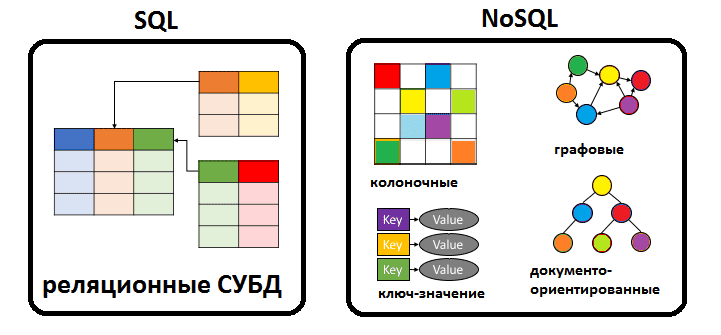

# Lecture 11
## NoSQL DB
- Mongo DB
- Redis
- Apache Cassandra
- etc....

### Data example

CategorySchema
```json
{
  {
    "id": 1,
    "title": "Front-end"
  },
  {
    "id": 2,
    "title": "Back-end"
  }
}
```
UserSchema
```json
{
  {
    "id": 1,
    "name": "Stella",
    "categoryId": 2
  },
  {
    "id": 2,
    "name": "Zlata",
    "categoryId": 1
  },
}
```
## Work with MongoDB in Node.js
- mongodb
- mongoose (ODM)
```js
const MongoClient = require("mongodb").MongoClient;
   
const url = "mongodb://localhost:27017/";
const mongoClient = new MongoClient(url, { useUnifiedTopology: true });
 
mongoClient.connect(function(err, client){
      
    const db = client.db("usersdb");
    const collection = db.collection("users");
    let user = {name: "Tom", age: 23};
    collection.insertOne(user, function(err, result){
          
        if(err){ 
            return console.log(err);
        }
        console.log(result.ops);
        client.close();
    });
});
```
```js
const mongoose = require('mongoose');
mongoose.connect('mongodb://localhost:27017/test', {useNewUrlParser: true, useUnifiedTopology: true});
const Cat = mongoose.model('Cat', { name: String });
const kitty = new Cat({ name: 'Zildjian' });
kitty.save().then(() => console.log('meow'));
```

## NoSQL vs SQL


- [Article](https://tproger.ru/translations/sql-vs-nosql/)
- [Article](https://www.bigdataschool.ru/wiki/nosql)

## Work with PG in Node.js
- pg
- pg-promise
- knex (SQL builder)
- sequelize (ORM)
- typeORM (ORM)

# Connection
```js
const { Pool } = require('pg');

class Database {
  constructor() {
    this.config = {
      user: 'empty-user',
      host: 'localhost',
      database: 'nothing',
      password: 'testpass',
      port: 5432,
    };

    this.pool = new Pool(this.config);
  }

  query(sql) {
    return this.pool.query(sql);
  }

  close() {
    this.pool.end();
  }
}
module.exports = new Database();
```
## Migrations
- We should have migrations for the easier switch with one db on another db.
- One migration must have 2 ways for run
- `Up` for tables update or create new tables
- `Down` to remove your changes after `Up`

Example for category

`Up`
```sql
START TRANSACTION;
  CREATE TABLE category (
      id serial PRIMARY KEY,
      name varchar NOT NULL
  );

  ALTER TABLE "user" ADD COLUMN categoryId int;
  ALTER TABLE "user" ADD CONSTRAINT fk_category FOREIGN KEY (categoryId) REFERENCES category (id);
COMMIT;
```
`Down`
```sql
START TRANSACTION;
  ALTER TABLE "user" DROP CONSTRAINT  fk_category;
  ALTER TABLE "user" DROP  categoryId;

  DROP TABLE category;
COMMIT;
```
## Global errors handler
```js
app.use(async (ctx, next) => {
  try {
    await next();
  } catch (err) {
    if (err.isJoi) {
      ctx.throw(400, err.details[0].message);
    }
    ctx.throw(400, 'Something wrong');
  }
});
```
## REDIS
 - [download](https://redis.io/)
 - [cloud usage](https://redislabs.com/)
 - [app for view](https://github.com/qishibo/AnotherRedisDesktopManager)

```js
const Redis = require('ioredis');
const redis = new Redis('redis://localhost:6379');
redis.set('iAmKey', JSON.stringify({name: 'Stella'}) // create
redis.get('iAmKey') //get
```
