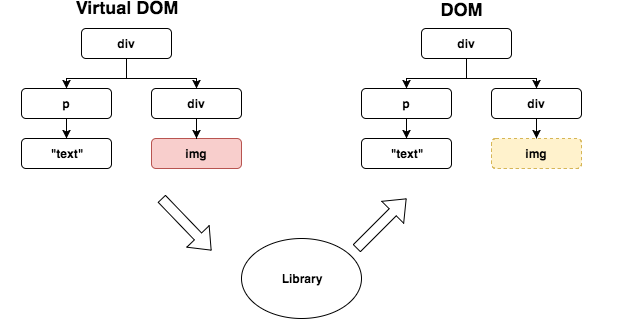
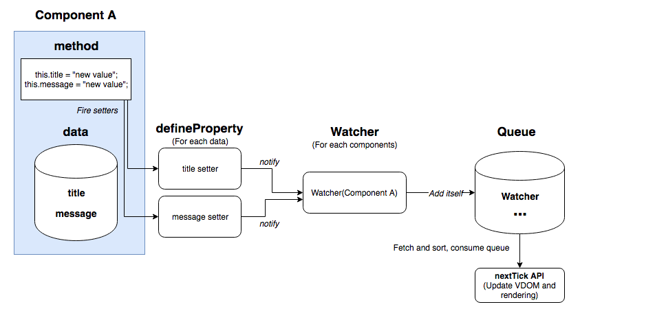
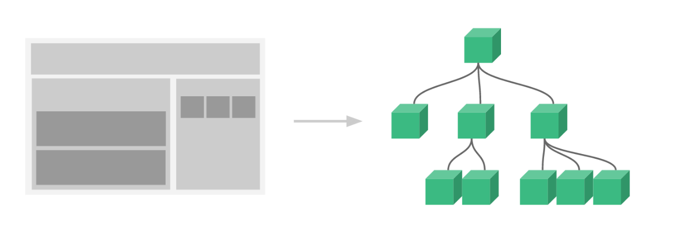

# Lecture 12
## Vue.js
Vue (pronounced /vjuː/, like view) is a progressive framework for building user interfaces. Unlike other monolithic frameworks, Vue is designed from the ground up to be incrementally adoptable.
## Installation

- `Direct <script> Include`
- `CDN`
- `NPM`
- `CLI`

## Vue devtools

https://github.com/vuejs/vue-devtools#vue-devtools

## Virtual DOM



```js
> var obj = {};
> Object.defineProperty(obj, "text", {
   get: function() {
     return text + "get";
   },
   set: function (newText) {
     text = newText + "set";
   }
  });
> obj.text = "text";
"text"
> obj.text
"textsetget"
```

## Vue object methods

- `Vue.extend` - allows to subclass the Vue object, to create a custom profile
- `Vue.nextTick` - defers the callback to be executed after the next DOM update cycle
- `Vue.set` - add a property to the object
- `Vue.delete` - delete a property from the object
- `Vue.directive` - set (or get) a global directive
- `Vue.filter` - set (or get) a global filter
- `Vue.component` - set (or get) a global component
- `Vue.use` - install a Vue.js plugin
- `Vue.mixin` - set a global mixin
- `Vue.compile` - compile a template string into a render function
- `Vue.version` - returns the currently installed version of Vue

## Components
```js
// Define a new component called button-counter
Vue.component('button-counter', {
  data: function () {
    return {
      count: 0
    }
  },
  template: '<button v-on:click="count++">You clicked me {{ count }} times.</button>'
})
```

https://vuejs.org/v2/guide/components.html https://flaviocopes.com/vue-cheat-sheet/#instance-properties

## Lifecycle Hooks

- `beforeCreate` - called before the app is created
- `created` - called after the app is created
- `beforeMount` - called before the app is mounted on the DOM
- `mounted` - called after the app is mounted on the DOM
- `beforeDestroy` - called before the app is destroyed
- `destroyed` - called after the app is destroyed
- `beforeUpdate` - called before a property is updated
- `updated` - called after a property is updated
- `activated` - called when a kept-alive component is activated
- `deactivated` - called when a kept-alive component is deactivated

## Directives

https://vuejs.org/v2/api/#Directives

### v-for

- Expects: Array | Object | number | string | Iterable (since 2.6)
- Usage

Render the element or template block multiple times based on the source data. The directive's value must use the special syntax alias in expression to provide an alias for the current element being iterated on:

```html
<div v-for="item in items">
  {{ item.text }}
</div>
```

Alternatively, you can also specify an alias for the index (or the key if used on an Object):

```html
<div v-for="(item, index) in items"></div>
<div v-for="(val, key) in object"></div>
<div v-for="(val, name, index) in object"></div>
```

The default behavior of v-for will try to patch the elements in-place without moving them. To force it to reorder elements, you need to provide an ordering hint with the key special attribute:

```html
<div v-for="item in items" :key="item.id">
  {{ item.text }}
</div>
```

In 2.6+, v-for can also work on values that implement the Iterable Protocol, including native Map and Set. However, it should be noted that Vue 2.x currently does not support reactivity on Map and Set values, so cannot automatically detect changes.

### v-bind

- Shorthand: `:`
- Expects: `any (with argument) | Object (without argument)`
- Argument: `attrOrProp (optional)`
- Modifiers: `prop` `camel` `sync`

## Usage
Dynamically bind one or more attributes, or a component prop to an expression.

When used to bind the class or style attribute, it supports additional value types such as Array or Objects. See linked guide section below for more details.

When used for prop binding, the prop must be properly declared in the child component.

When used without an argument, can be used to bind an object containing attribute name-value pairs. Note in this mode class and style does not support Array or Objects.
## Example:
```html
<!-- bind an attribute -->


<!-- dynamic attribute name (2.6.0+) -->
<button v-bind:[key]="value"></button>

<!-- shorthand -->


<!-- shorthand dynamic attribute name (2.6.0+) -->
<button :[key]="value"></button>

<!-- with inline string concatenation -->


<!-- class binding -->
<div :class="{ red: isRed }"></div>
<div :class="[classA, classB]"></div>
<div :class="[classA, { classB: isB, classC: isC }]">

<!-- style binding -->
<div :style="{ fontSize: size + 'px' }"></div>
<div :style="[styleObjectA, styleObjectB]"></div>

<!-- binding an object of attributes -->
<div v-bind="{ id: someProp, 'other-attr': otherProp }"></div>

<!-- DOM attribute binding with prop modifier -->
<div v-bind:text-content.prop="text"></div>

<!-- prop binding. "prop" must be declared in my-component. -->
<my-component :prop="someThing"></my-component>

<!-- pass down parent props in common with a child component -->
<child-component v-bind="$props"></child-component>

<!-- XLink -->
<svg><a :xlink:special="foo"></a></svg>
```


### v-on

- Shorthand: `@`
- Expects: `Function` | `Inline Statement` | `Object`
- Argument: `event`

Modifiers

- `.stop` - call event.stopPropagation().
- `.prevent` - call event.preventDefault().
- `.capture` - add event listener in capture mode.
- `.self` - only trigger handler if event was dispatched from this element.
- `.keyCode | keyAlias}` - only trigger handler on certain keys.
- `.native` - listen for a native event on the root element of component.
- `.once` - trigger handler at most once.
- `.left` - (2.2.0+) only trigger handler for left button mouse events.
- `.right` - (2.2.0+) only trigger handler for right button mouse events.
- `.middle` - (2.2.0+) only trigger handler for middle button mouse events.
- `.passive` - (2.3.0+) attaches a DOM event with { passive: true }.

Usage:

Attaches an event listener to the element. The event type is denoted by the argument. The expression can be a method name, an inline statement, or omitted if there are modifiers present.

When used on a normal element, it listens to native DOM events only. When used on a custom element component, it listens to custom events emitted on that child component.

When listening to native DOM events, the method receives the native event as the only argument. If using inline statement, the statement has access to the special $event property: v-on:click="handle('ok', $event)".

Starting in 2.4.0+, v-on also supports binding to an object of event/listener pairs without an argument. Note when using the object syntax, it does not support any modifiers.