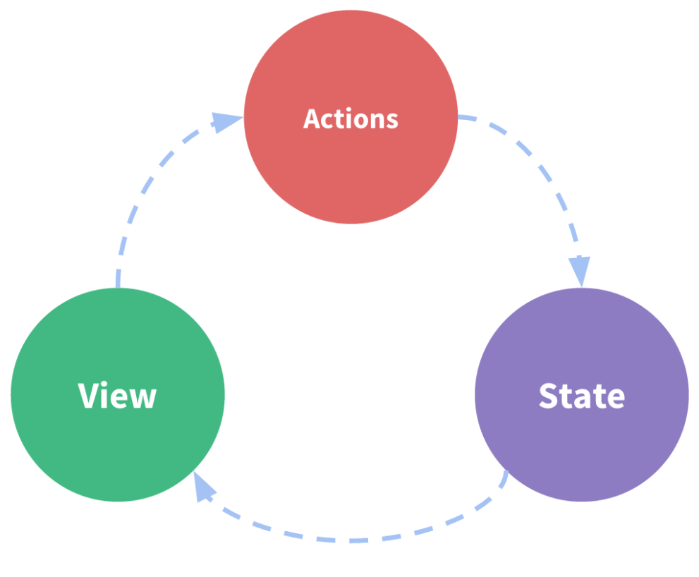
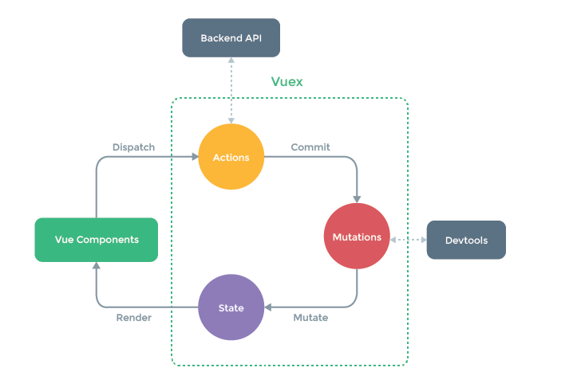
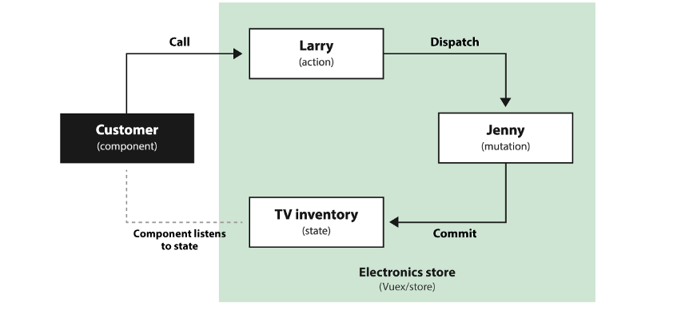

### Lecture 14

Flux libraries are like glasses: you’ll know when you need them.

https://vuejs.org/v2/guide/state-management.html#Simple-State-Management-from-Scratch





* https://vuex.vuejs.org/

* https://medium.com/@KucherDev/vuex-%D1%8D%D1%82%D0%BE-%D0%BF%D1%80%D0%BE%D1%81%D1%82%D0%BE-6807d9ad330d



* reactivity
* history control
* easy access from any part of app

## Local Storage

https://developer.mozilla.org/ru/docs/Web/API/Window/localStorage

```js
localStorage = window.localStorage;
localStorage.setItem('myCat', 'Tom');
let cat = localStorage.getItem('myCat');
```
