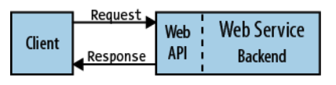
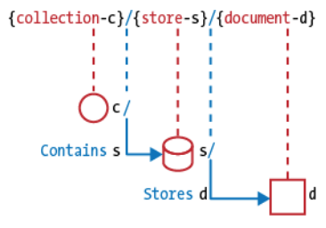

# Lecture 17

### Client - Server architecture



### REST

**REST** - Representational State Transfer, Roy Fielding's derivation of the Web architectural style.

### URIs

http://www.rfc-editor.org/rfc/rfc3986.txt

RFC 3986 present the next URI format:

```
URI = scheme "://" authority "/" path [ "?" query ] [ "#" fragment ]
```

### URI Format rules

- Forward slash separator (`/`) must be used to indicate a hierarchical
  relationship

> [!TIP] > `https://api.example.com/shapes/polygons/squares`

- A trailing forward slash (`/`) should not be included in URIs

> [!TIP] > `https://api.example.com/users/` <br> > `https://api.example.com/users`

- Hyphens (`-`) should be used to improve the readability of URIs

> [!TIP] > `https://api.example.com/blogs/john-doe/this-is-my-first-post`

- Underscores (`_`) should not be used in URIs
- Lowercase letters should be preferred in URI paths
- File extensions should not be included in URIs

### URI Authority design

- Consistent subdomain names should be used for your APIs

> [!TIP] > `https://api.example.com/` <br>

> [!DANGER] > `https://server.example.com/` <br> > `https://data.example.com/` <br> > `https://example.com/api/` <br>

- Consistent subdomain names should be used for your client developer
  portal

> [!TIP] > `https://developers.example.com/`

### Resource Modeling



**Document** - resource, object or instance, database record.

**Collection** - server-managed directory of resources.

**Store** - client-managed resource repository. A store resource lets an API client put resources in, get them back out, and decide when to delete them. On their own, stores do not create new resources; therefore a store never generates new URIs. Instead, each stored resource has a URI that was chosen by a client when it was initially put into the store.

### URI Path Design

- A singular noun should be used for document names
- A plural noun should be used for collection names
- A plural noun should be used for store names
- A verb or verb phrase should be used for controller names
- Variable path segments may be substituted with identity-based
  values
- CRUD function names should not be used in URIs

> [!TIP]
> DELETE `/users/1234`

> [!DANGER]
> GET `/deleteUser?id=1234` <br>
> GET `/deleteUser/1234` <br>
> DELETE `/deleteUser/1234` <br>
> POST `/users/1234/delete`

### URI Query Design

- The query component of a URI may be used to filter collections or stores

> [!TIP]
> GET `/users` <br>
> GET `/users?role=admin`

- The query component of a URI should be used to paginate collection
  or store results

> [!TIP]
> GET `/users?pageSize=25&pageStartIndex=50`

### HTTP Interaction Design

- GET and POST must not be used to tunnel other request methods
- GET must be used to retrieve a representation of a resource
- HEAD should be used to retrieve response headers
- PUT must be used to both insert and update a stored resource
- POST must be used to create a new resource in a collection
- DELETE must be used to remove a resource from its parent
- OPTIONS should be used to retrieve metadata that describes a
  resource’s available interactions

### Response Status Codes

- `200 ("OK")` should be used to indicate nonspecific success
- `200 ("OK")` must not be used to communicate errors in the response body
- `201 ("Created")` must be used to indicate successful resource creation
- `202 ("Accepted")` must be used to indicate successful start of an asynchronous action
- `204 ("No Content")` should be used when the response body is intentionally empty
- `301 ("Moved Permanently")` should be used to relocate resources
- `302 ("Found")` should not be used
- `303 ("See Other")` should be used to refer the client to a different URI
- `304 ("Not Modified")` should be used to preserve bandwidth
- `307 ("Temporary Redirect")` should be used to tell clients to resubmit the request to another URI
- `400 ("Bad Request")` may be used to indicate nonspecific failure
- `401 ("Unauthorized")` must be used when there is a problem with the client’s credentials
- `403 ("Forbidden")` should be used to forbid access regardless of authorization state
- `404 ("Not Found")` must be used when a client’s URI cannot be mapped to a resource
- `405 ("Method Not Allowed")` must be used when the HTTP method is not supported
- `406 ("Not Acceptable")` must be used when the requested media type cannot be served
- `409 ("Conflict")` should be used to indicate a violation of resource state
- `412 ("Precondition Failed")` should be used to support conditional operations
- `415 ("Unsupported Media Type")` must be used when the media type of a request’s payload cannot be processed
- `500 ("Internal Server Error")` should be used to indicate API malfunction
