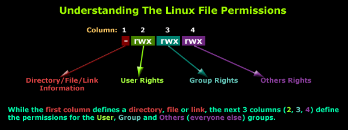

# Lecture 19

## Linux Basics. Shell Scripting

### Navigating the File System

#### The Command Line

The command line allows a user to navigate the filesystem and run built-in programs or custom scripts. In Unix, the
command line interface is called Bash, and the shell prompt is the $.

```bash
$ 
```

#### `pwd` Print Working Directory

The shell command pwd displays the file path from the root directory to the current working directory.

```bash
$ pwd
/Users/sonny/Downloads
```

#### `mkdir` Make Directory

The shell command mkdir is used to make a new directory in the filesystem according to its argument. If a file path is
given, the new directory will be placed at the end. Otherwise, it will create a new directory in the current working
directory.

```bash
$ mkdir new-directory
$ ls 
old-directory    new-directory
```

#### `ls` List

The shell command ls is used to list the contents of a directory. If no arguments are given, it will list the contents
of the current working directory.

```bash
$ ls Desktop
resume.pdf
photo.png
```

`ls` command can be combined with the following command options:

- -a: lists all contents, including hidden files and directories.
- -l: lists all contents, in long format.
- -t: lists all contents, by the time they were last modified.

```
$ ls -a
$ ls -l
$ ls -t
```

#### `cd` Change Directory

The shell command cd is used to move throughout the filesystem of a computer. It accepts a variety of arguments:

- Full file paths.
- Names of children of the current directory.
- `..` the parent of the current directory.

```
$ cd some-directory
$ cd ..
```

#### `touch` Create New File

The shell command touch creates a new file in the current working directory with the name provided.

$ touch grocery-list.txt

#### Helper Commands

Helper commands for the command line include:

- `clear` to clear the terminal
- tab to autocomplete the line
- ↑ and ↓ to cycle through previous commands

### Viewing and Changing the File System

#### `cp` Copy

The shell command cp is used to copy files or directories.

The basic argument structure is cp source destination, where the source is the file/directory to copy to the destination
file/directory.

```bash
$ cp file1 file1_copy
$ cp file1 file2 destination_folder

```

#### `mv` Move

The shell command mv is used to move a file into a directory. Use mv with the source file as the first argument and the
destination directory as the second argument.

```bash
$ mv index.html website/
```

#### `rm` Remove

The shell command rm is used to delete files and directories. The -r flag deletes a directory and all of its files and
directories (rm -r).

```bash
$ rm -r bad_selfies
```

### Redirecting Input and Output

#### Append Redirect shell command

The ``>>`` shell command is used to redirect the standard output of the command on the left and append (add) it to the
end of the file on the right.

```bash
# This command will append "Hello World!" to greetings.txt
echo "Hello World!" >> greetings.txt
```

#### Pipe shell command

The `|` command is called a pipe. It is used to pipe, or transfer, the standard output from the command on its left into
the standard input of the command on its right.

```bash
# First, echo "Hello World" will send Hello World to the standard output.
# Next, pipe | will transfer the standard output to the next command's standard input.
# Finally, wc -w will count the number of words from its standard input, which is 2.
echo "Hello World" | wc -w
```

#### Redirecting Output

The > symbol is used to redirect output by taking the output from the command on the left and passing as input to the
file on the right.

```bash
echo "Hello" > hello.txt
```

#### `cat` Display

The shell command cat displays the contents of one or more files to the terminal.

```bash
$ cat poem.txt
$ cat poem.txt kitties.txt
```

#### `tail` Command
Used to output last part of file. By default, tail returns the last ten lines of each file that it is given. 
It may also be used with `-f` flag to follow a file in real-time and watch as new lines are written to a file.

#### `grep` Search

The shell command `grep` is used to search files for lines that match a pattern and returns the results. Various options
can be specified along with the grep command to specify the search.

In the provided example, the lines in the file names.txt which contain “sonny” will be returned.

```bash
grep 'sonny' names.txt
```

#### Case insensitive search

The grep command with the -i option can be used to search files for lines that match a pattern, case insensitive, and
returns the results.

#### `find` shell command

The shell command `find` can be used with '-name' option to search for files in current directory and all
subdirectories.

```bash
find . -name "somefile*"
```

#### Command Line Redirection

On a command line, redirection is the process of using the input/output of a file or command to use it as an input for
another file. It is similar but different from pipes, as it allows reading/writing from files instead of only commands.

Redirection can be done by using the operators > and >>.

```bash
ls > directories_list.txt
ls >> directories_list.txt
```

## Permissions & Ownership



### Changing permissions

Syntax:

```bash
chmod permissions filename
```

#### Absolute Mode

Schema:

r | w | x
--- | --- | ---
4 | 2 | 1

Extended:

Number | Permission Type | Symbol
--- | --- | ---
0 |    No Permission|    ---
1 |    Execute | --x
2 | Write | -w-
3 | Execute + Write    | -wx
4 | Read | r--
5 | Read + Execute | r-x
6 | Read + Write | rw-
7 | Read + Write + Execute | rwx

Permission is set in the following order:

Example:

```bash
chmod 764 sample.txt
```

`764` absolute code says the following:

- 7 - Owner can read, write and execute
- 6 - Usergroup can read and write
- 4 - Others can only read

#### Symbolic Mode

Operator |    Description
--- | ---
+ | Adds a permission to a file or directory
- | Removes the permission
= | Sets the permission and overrides the permissions set earlier.

User Denotations:

Flag | Meaning
--- | ---
u | user/owner
g |    group
o | other
a | all

Example:

```bash
# grant execution access to user
chmod u+x sample.sh
```

```bash
# grant full access to group
chmod g=rwx sample.sh
```

### Changing Ownership

```bash
chown user
```

```bash
chown user:group filename
```

## Shell Scripting

Basic example:

```bash
#!/bin/bash

# #This is a script that greets the world
# Usage: ./hello

clear
echo hello world
exit 0
```

#### Arguments:

```bash
#!/bin/bash
# run this script with a few arguments
echo The first argument is $1
echo The second argument is $2
echo The third argument is $3
```

#### Loops:

```bash
#!/bin/bash
# run this script with a few arguments 
echo you have entered $# arguments
for i in $@
 do
       echo $i
 done
exit 0
```

`$#` - arguments counter
`$@` - all arguments

#### Conditions:

```bash
if [ -z $1 ]; then
  echo no argument provided
else
  echo you provided argument $1
fi
```

`-z` - check if argument is empty.

```bash
#!/bin/bash
# run this script with one argument
# the goal is to find out if the argument is a file or a directory
if [ -f $1 ]
then
    echo "$1 is a file"
elif [ -d $1 ]
then
    echo "$1 is a directory"
else
    echo "I do not know what \$1 is"
fi
exit 0
```

#### Logical operators

Statement after `&&` will be executed only if first half of the command is true (command exits with code 0)

```bash
[ -z $1 ] && echo no argument provided
```

## Configuring the Environment

#### Command line environment

The environment of the command line refers to the settings and preferences of the current user. It enables users to set
greetings, alias commands, variables, and much more.

#### Shell Command env

For Unix-based systems like Mac OS and Linux, the shell command env returns a list of environment variables for the
current user.

#### Alias

The shell command `alias` is used to assign commonly used commands to shortcuts (or aliases). The assigned commonly used
command should be wrapped in double quotes.

```bash
# The following command creates an alias `pd` for the command `pwd`
alias pd="pwd"
```

#### Environment Variables

Variables that can be used across terminal commands are called environment variables. They also hold information about
the shell’s environment.

#### Source Bash Profile

All the commands in **~/.bash_profile** are executed with the shell command `source ~/.bash_profile`. So when changes
are made to **~/.bash_profile**, run this command to activate the changes in the current session.

#### history Command

The `history` shell command is used to get a history of commands (also known as “events”) that were executed in the
current session. The command also allows us to perform operations on this list of commands that have been executed, such
as selecting or manipulating a command in the history.

#### Export command

The `export` command makes a given variable available to all child sessions initiated from the current session.

```bash
# This command will make the environment variable USER available 
# to all child sessions with the value "Jane Doe".
export USER="Jane Doe"
```

#### HOME Environment Variable in Unix Systems

`HOME` is an environment variable present in command line environments. It is used to get the path to the current user’s
home directory. This makes it easy for programs to access the home directory when needed.

```bash
# To show the path of the home directory use the following command:
 
echo $HOME
```

#### PATH Environment Variable

Let's say you wrote a little shell script called hello.sh and have it located in a directory called
/place/with/the/file. This script provides some useful function to all the files in your current directory, that you'd
like to be able to execute no matter what directory you're in.

Simply add /place/with/the/file to the $PATH variable with the following command:

```bash
export PATH=$PATH:/place/with/the/file 
```

You should now be able to execute the script anywhere on your system by just typing in its name, without having to
include the full path as you type it.

To make this change permanent, add the line above to the appropriate file that will be read when your shell
launches: ` ~/.bash_profile`, `~/.bashrc`, or `~/.profile`.


## Packaging

Debian Linux uses [dpkg managing system](https://wiki.debian.org/DebianPackageManagement). A packaging system is a way
to provide programs and applications for installation. [APT](https://wiki.debian.org/Apt) (Advanced Package Tool) is
the command line tool to interact with the packaging system in Debian-based Linux distributions.

Installing a package:

```bash
apt install package_name
```
