# Lecture 2
### Intro to VCS
**Version Control System** - the way to store the history of changes in certain files.

### Purpose
- Full history of every file, which gives you possibility to go back to previous version of your codebase, analyze source of bugs and fix them.
- Ability to work on a development team, where each member can modify similar parts of the code without pain.
- Ability to track each change and describe purpose of the change
- Connection to project management system
- Connection to bug tracking software

### VCS types
- **Centralized version control** - all project files are saved on a version control server. You pull and work only with certain files. You don't need full copy of your project locally.
- **Distributed version control** - you can clone a copy of a repository to your local machine, so you will have the full history of the project.


### Version Control Systems
- Centralized:
    - Subversion (SVN)
    - Perforce
- Distributed:
    - Git
    - Mercurial

### VCS services
- GitHub - https://github.com/pricing
- Bitbucket - https://bitbucket.org/product/pricing
- GitLab - https://about.gitlab.com/pricing/

### Glossary
- **Repository** - data structure which stores your project files and directories.
- **Commit** - checkpoint, adds changes to head revision of repository.
- **Branch** - an active live of development.
- **Conflict** - a situation when several users made changes in the same file and trying to push them.
- **Merge** - bring content from one branch to another.
- **Fetch** - get branch missing files from remote repository.
- **Pull** - fetch and merge branch.
- **Push** - putting all modified local files into the remote repository.
- **Rebase** - reapply changes from a branch to a different state.
- **Revision** - synonym for commit.
- **Tag** - namespace that points to an object.
- **Master** - the default development branch.

### Commands
- Initialize git repository on local machine
```bash
git init
```

- Specify remote repository
```bash
git remote add origin https://github.com/<username>/<repository_name>.git
```

- Adding files
```bash
git add example.txt
```
```bash 
git add --all
```
```bash
git add .
```
```bash
git add src/
```
- Check current status
```bash
git status
```
- Reset added files
```bash
git reset
```
- Remove files from staging
```bash
git restore --staged <filename>
```
- Commit your changes
```bash
git commit -m "Remove old bug, add new one"
```
- Push change to the remote repository
```bash
git push <remote_name> <branch_name>
```
- Get changes from the remote
```bash
# runs 'fetch' and 'merge' by default, or 'rebase' if using --rebase flag
git pull <remote_name> <branch_name>
git pull
```
```bash
# downloads objects & files from repository
git fetch origin <branch_name>
git fetch
```
```bash
# clone repository to a local machine
git clone https://github.com/<username>/<repository_name>.git
```
### Branching
- Create branch
```bash
git branch crazy-experiment
```
- Delete branch
```bash
git branch -d crazy-experiment
```
- Move to branch
```bash
git checkout crazy-experiment
```
- Show current branch
```bash
git branch
```
- Create and move to new branch
```bash
git checkout -b crazy-experiment
```
### Typical branching flow
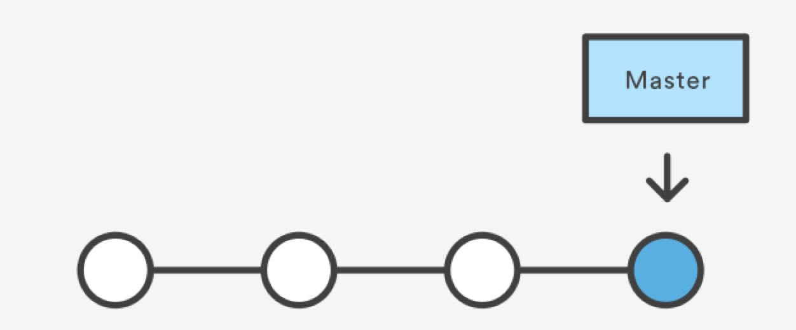
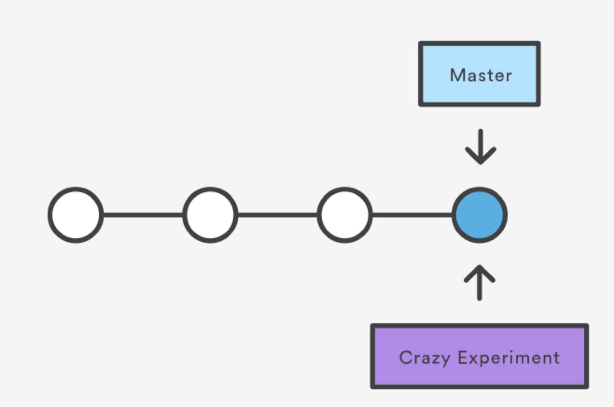
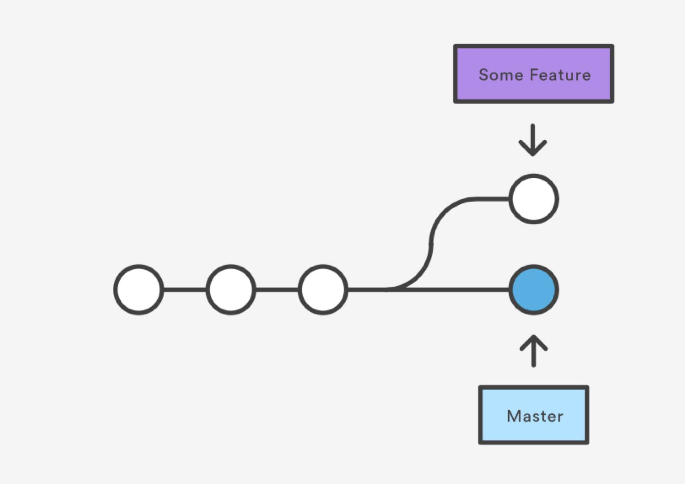
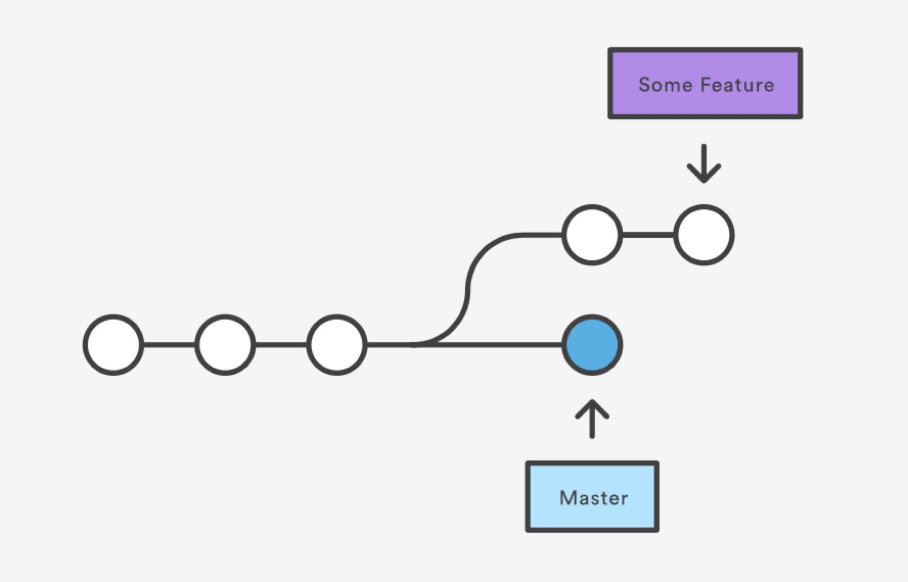
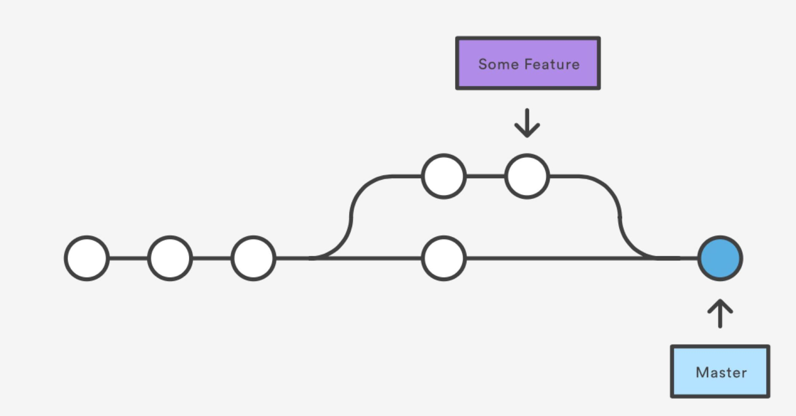


```bash
git merge crazy-experiment
```

### Useful tricks
- Removing commit
```bash
# locally
git reset --hard HEAD~1
```
```bash
# from remote
git push origin HEAD --force
```

- Stashing
```bash
# stash changes
git stash
```
```bash
# get from stash
git stash pop
```

- Squash commits
```bash
git rebase -i <commit_hash>
```
Change `pick` to `squash` for a commit you want to meld into a previous one.
```bash
pick 8f59fe1 initial commit
pick 7e9b63f add some feature   # <---
squash 94d96b5 cleanup          # <--- these two commits will be squashed together
```

- Reverting changes
```bash
git revert <commit_hash>
```


- Keep empty directory in VCS
Just place empty `.gitkeep` file in that directory

### .gitignore && .gitignore_global
```text
# Ignore all files & folders & subfloders
*
# Ignore all files with .txt extension
*.txt
# Ignore specific file
example.com
# Ignore specific directory (nested)
/dist
# Ignore specific files in specific directory
/dist/*.jpg
# Ignore specific files in specific directory (nested)
/dist/**/*.jpg
# Ignore directory except single file
/dist/*
!/dist/example.txt
# Ignore files by mask in name (will work with /dist/img/a/test.jpg, /dist/img/a1/test.jpeg etc)
/dist/img/a?/*.jp?g
```

.gitattributes


### Gitflow
Gitflow - branching model for Git, authored by Vincent Driessen. Made for collaboration and easy maintenance.

**Pros**:

- Simultaneously development
- Staging
- Collaboration
- Hotfixes

**Cons**:

None

**How it works**

- Feature branches

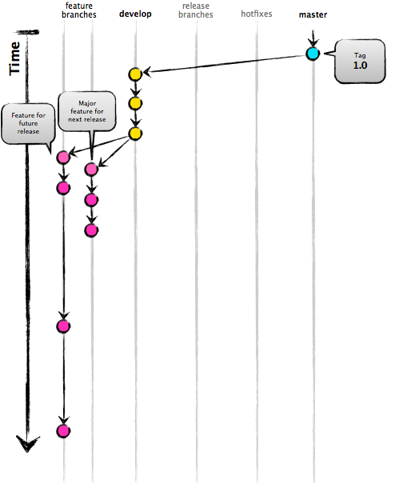

- Development branch

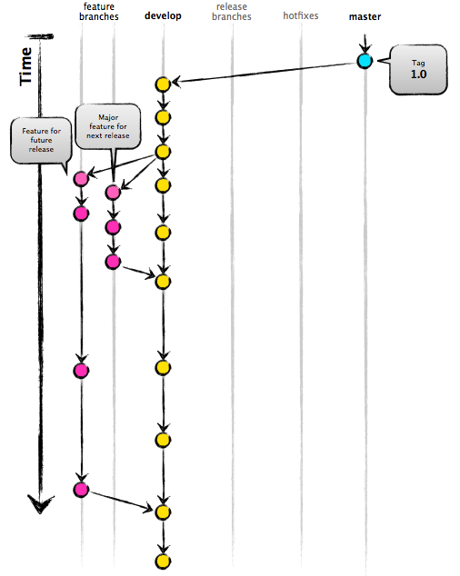

- Release branch

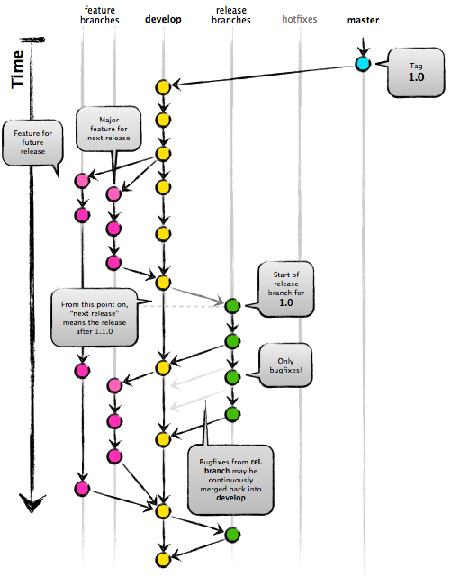

- Merge to master and dev branches

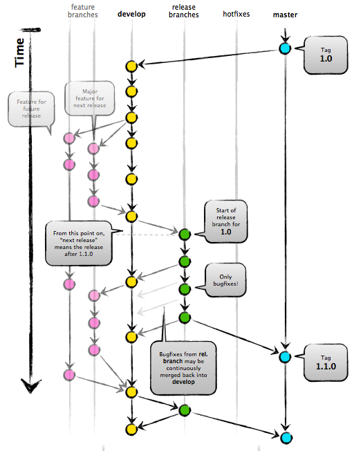

- Hotfixes

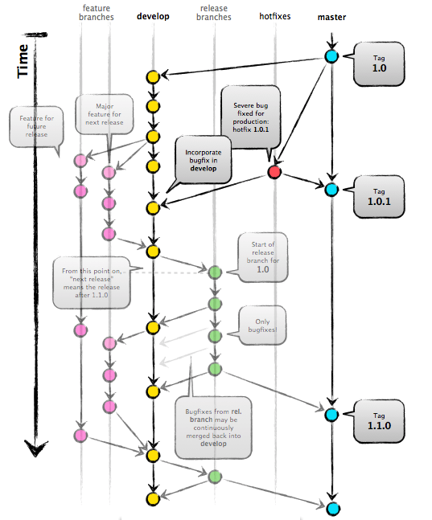
  
### Github templates
Go to project settings:
https://github.com/<username>/<repo_name>/settings
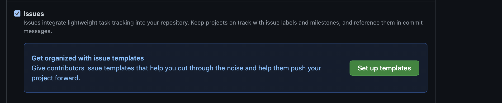

- Issue templates in .github/ISSUES_TEMPLATE/*.md
  - Bug report
  - Feature request
  - Custom template
  


- Pull request templates in .github/PULL_REQUEST_TEMPLATE.md

```text
### All Submissions:

* [ ] Have you followed the guidelines in our Contributing document?
* [ ] Have you checked to ensure there aren't other open 
[Pull Requests](https://github.com/<username>/<repo_name>/pulls) for the same update/change?

<!-- You can erase any parts of this template not applicable to your Pull Request. -->

### New Feature Submissions:

1. [ ] Does your submission pass tests?
2. [ ] Have you lint your code locally prior to submission?

### Changes to Core Features:

* [ ] Have you added an explanation of what your changes do and why you'd like us to include them?
* [ ] Have you written new tests for your core changes, as applicable?
* [ ] Have you successfully ran tests with your changes locally?

```

### Github pages
GitHub Pages is a static site hosting service that takes HTML, CSS, and JavaScript files 
straight from a repository on GitHub, optionally runs the files through a build process, and publishes a website.