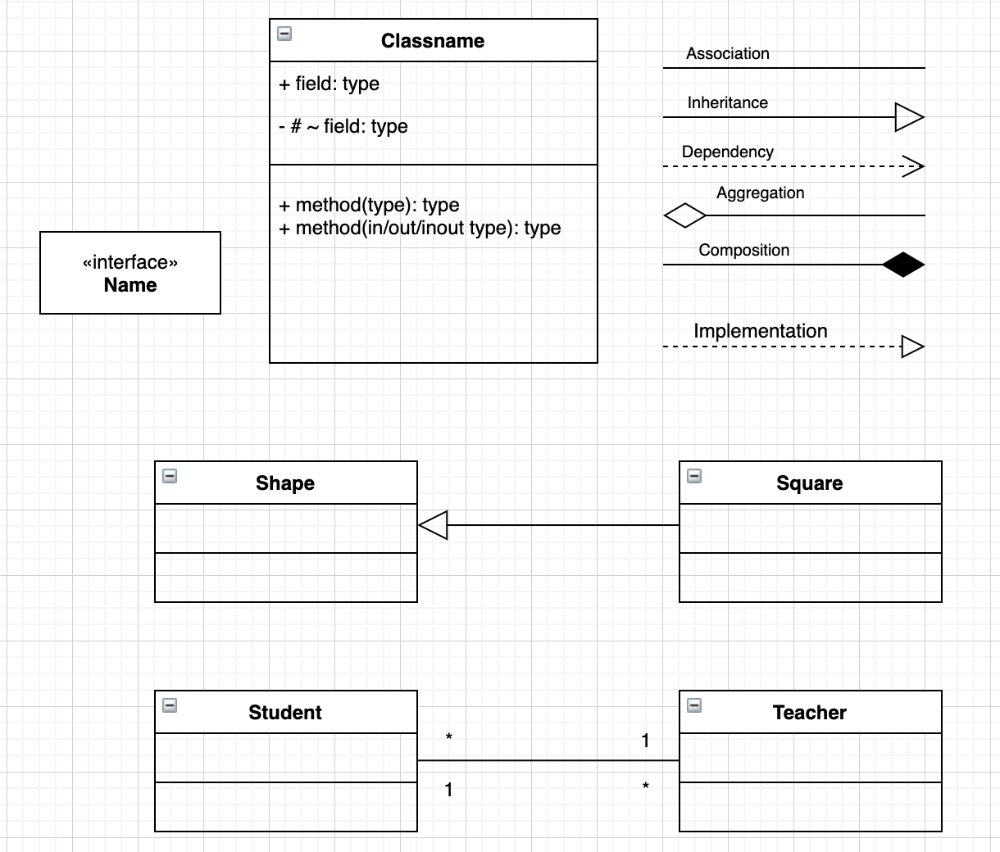
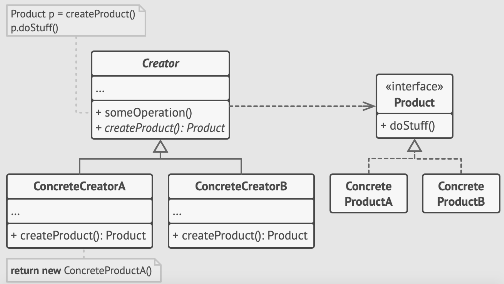
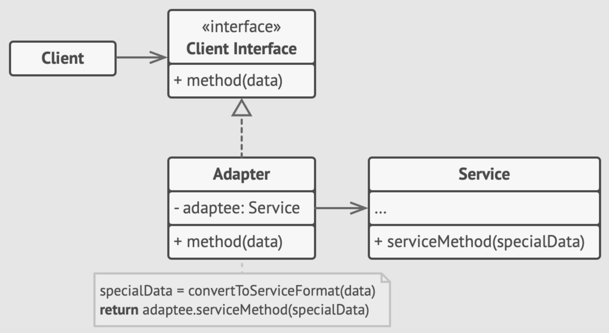
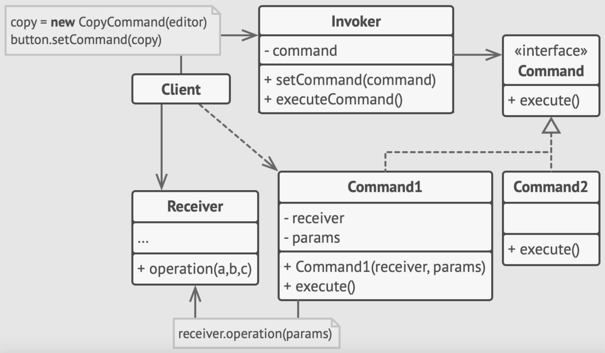

### UML



### Design Patterns

###### Signleton

```ts
class Singleton {
  private static instance: Singleton;

  private constructor() { }

  public static getInstance(): Singleton {
    if (!Singleton.instance) {
        Singleton.instance = new Singleton();
    }

    return Singleton.instance;
  }

  public someBusinessLogic() {
    console.log('Business logics');
  }
}

function clientCodeSingle() {
  const s1 = Singleton.getInstance();
  const s2 = Singleton.getInstance();

  if (s1 === s2) {
      console.log('Singleton works, both variables contain the same instance.');
  } else {
      console.log('Singleton failed, variables contain different instances.');
  }
}

clientCodeSingle();
```

###### Factory

```ts
abstract class Creator {
  public abstract factoryMethod(): Product;

  public someOperation(): string {
      const product = this.factoryMethod();
      return `Creator: The same creator's code has just worked with ${product.operation()}`;
  }
}

class ConcreteCreator1 extends Creator {
  public factoryMethod(): Product {
      return new ConcreteProduct1();
  }
}

class ConcreteCreator2 extends Creator {
  public factoryMethod(): Product {
      return new ConcreteProduct2();
  }
}

interface Product {
  operation(): string;
}

class ConcreteProduct1 implements Product {
  public operation(): string {
      return '{Result of the ConcreteProduct1}';
  }
}

class ConcreteProduct2 implements Product {
  public operation(): string {
      return '{Result of the ConcreteProduct2}';
  }
}

function clientCode(creator: Creator) {
  console.log('Client: I\'m not aware of the creator\'s class, but it still works.');
  console.log(creator.someOperation());
}

console.log('App: Launched with the ConcreteCreator1.');
clientCode(new ConcreteCreator1());
console.log('');

console.log('App: Launched with the ConcreteCreator2.');
clientCode(new ConcreteCreator2());
```

###### Adapter

```ts
class Target {
  public request(): string {
      return 'Target: The default target\'s behavior.';
  }
}

class Adaptee {
  public specificRequest(): string {
      return '.eetpadA eht fo roivaheb laicepS';
  }
}

class Adapter extends Target {
  private adaptee: Adaptee;

  constructor(adaptee: Adaptee) {
      super();
      this.adaptee = adaptee;
  }

  public request(): string {
      const result = this.adaptee.specificRequest().split('').reverse().join('');
      return `Adapter: (TRANSLATED) ${result}`;
  }
}

function clientCodeAdapter(target: Target) {
  console.log(target.request());
}

console.log('Client: I can work just fine with the Target objects:');
const target = new Target();
clientCodeAdapter(target);

console.log('');

const adaptee = new Adaptee();
console.log('Client: The Adaptee class has a weird interface. See, I don\'t understand it:');
console.log(`Adaptee: ${adaptee.specificRequest()}`);

console.log('');

console.log('Client: But I can work with it via the Adapter:');
const adapter = new Adapter(adaptee);
clientCodeAdapter(adapter);
```

###### Command

```ts
interface Command {
  execute(): void;
}

class SimpleCommand implements Command {
  private payload: string;

  constructor(payload: string) {
      this.payload = payload;
  }

  public execute(): void {
      console.log(`SimpleCommand: See, I can do simple things like printing (${this.payload})`);
  }
}

class ComplexCommand implements Command {
  private receiver: Receiver;

  private a: string;

  private b: string;

  constructor(receiver: Receiver, a: string, b: string) {
      this.receiver = receiver;
      this.a = a;
      this.b = b;
  }

  public execute(): void {
      console.log('ComplexCommand: Complex stuff should be done by a receiver object.');
      this.receiver.doSomething(this.a);
      this.receiver.doSomethingElse(this.b);
  }
}

class Receiver {
  public doSomething(a: string): void {
      console.log(`Receiver: Working on (${a}.)`);
  }

  public doSomethingElse(b: string): void {
      console.log(`Receiver: Also working on (${b}.)`);
  }
}

class Invoker {
  private onStart: Command;

  private onFinish: Command;

  public setOnStart(command: Command): void {
      this.onStart = command;
  }

  public setOnFinish(command: Command): void {
      this.onFinish = command;
  }

  public doSomethingImportant(): void {
      console.log('Invoker: Does anybody want something done before I begin?');
      if (this.isCommand(this.onStart)) {
          this.onStart.execute();
      }

      console.log('Invoker: ...doing something really important...');

      console.log('Invoker: Does anybody want something done after I finish?');
      if (this.isCommand(this.onFinish)) {
          this.onFinish.execute();
      }
  }

  private isCommand(object): object is Command {
      return object.execute !== undefined;
  }
}

const invoker = new Invoker();
invoker.setOnStart(new SimpleCommand('Say Hi!'));
const receiver = new Receiver();
invoker.setOnFinish(new ComplexCommand(receiver, 'Send email', 'Save report'));

invoker.doSomethingImportant();
```


### Algorithms

###### Complexity - O

- O(log(n))
- O(n)
- O(n*log(n)), 
- O(n^2)
- O(n!)
- O(√n)

###### Linear search

**Linear search** - sequentially check each element of the list to be equal to found item. Search until found or to the end of list.


> Complexity O(n)

```js
function linearSearch(arr, itemToSearch) {
  for (let i = 0; i < arr.length; i++) { 
    if (arr[i] === itemToSearch) {
      return i;
    }
  }
  return -1;
}

let arr = ['a', 'b', 'c', 'd', 'e'];
console.log(linearSearch(arr, 'd'));
```

###### Binary search

**Binary search** - or half-interval search, works with sorted array of items. Compares tha target value with the middle item of the array, if they are unequal, the half in which that target cannot lie is eliminated and the search continues with the other half, until found or search reach the end of array.


> Complexity O(log(n))

```js
function compare(item1, item2) {
  if (item1 === item2) {
    return 0;
  }
  return item1 < item2 ? -1 : 1;
}

function binarySearch(sortedArr, itemToSearch) {
  let startIndex = 0;
  let endIndex = sortedArr.length - 1;

  while (startIndex <= endIndex) {
    const middleIndex = startIndex + Math.floor((endIndex - startIndex) / 2);
    if (sortedArr[middleIndex] === itemToSearch) {
      return middleIndex;
    }
    if (compare(sortedArr[middleIndex], itemToSearch) < 0) {
      startIndex = middleIndex + 1;
    } else {
      endIndex = middleIndex - 1;
    }
  }
  return -1;
}

let arr = ['a', 'b', 'c', 'd', 'e'];
console.log(binarySearch(arr, 'd'));
```

###### Block(jump) search

**Block(jump) search** - works with sorted arrays. Idea is to check fewer elements than linear search by jumping ahead by fixed steps or skipping some elements.

`arr[k * m] < x < arr[(k + 1) * m]` rule when we start apply the linear search.
- m - jump size
- k - operator
- x - element to find

The best jump size step is - `m = √n`

> Complexity O(√n)

```js
function compare(item1, item2) {
  if (item1 === item2) {
    return 0;
  }
  return item1 < item2 ? -1 : 1;
}

function jumpSearch(sortedArr, itemToSearch) {
  let jumpSize = Math.floor(Math.sqrt(sortedArr.length));
  let blockStart = 0;
  let blockEnd = jumpSize;
  while(compare(itemToSearch, sortedArr[Math.min(blockEnd, sortedArr.length) - 1]) > 0 ) {
    blockStart = blockEnd;
    blockEnd += jumpSize;
    if (blockStart > sortedArr.length) {
      return -1;
    }
  }
  let currentIndex = blockStart;
  while(currentIndex < Math.min(blockEnd, sortedArr.length)) {
    if (compare(sortedArr[currentIndex], itemToSearch) === 0) {
      return currentIndex;
    }
    currentIndex += 1;
  }
  return -1;
}

let arr = ['a', 'b', 'c', 'd', 'e'];
console.log(jumpSearch(arr, 'd'));
```

###### Bubble sort

**Bubble sort** - compare each pair of adjasted array elements and swap them if they are in the wrong ordering. Pass through the list is repeated until no swaps needed. 


> Complexity O(n^2)

```js
function bubbleSort(arr) {
  let swapped;
  do {
    swapped = false;
    for (let i = 0; i < arr.length; i++) {
      if (arr[i] > arr[i + 1]) {
        let tmp = arr[i];
        arr[i] = arr[i + 1];
        arr[i + 1] = tmp;
        swapped = true;
      }
    }
  } while (swapped);
  return arr;
}

let arr = ['c', 'e', 'b', 'a', 'd'];
console.log(bubbleSort(arr));
```

###### Selection sort

**Selection sort** - finds minimum value in input array, swap this value with value from first unsorted item.


> Complexity O(n^2)

```js
function compare(item1, item2) {
  if (item1 === item2) {
    return 0;
  }
  return item1 < item2 ? -1 : 1;
}

function selectionSort(arr) {
  for (let i = 0; i < arr.length - 1; i++) {
    let minIndex = i;
    for (let j = i + 1; j < arr.length; j++) {
      if (compare(arr[j], arr[minIndex]) < 0) {
        minIndex = j;
      }
    }
    if (minIndex !== i) {
      [arr[i], arr[minIndex]] = [arr[minIndex], arr[i]];
    }
  }
  return arr;
}

let arr = ['c', 'e', 'b', 'a', 'd'];
console.log(selectionSort(arr));
```

###### Quick sort

**Quick sort** - pick pivot element, reorder array, so all items with values great thatn pivot comes after the pivot. After this partioning the pivot is the last element of the new formed array. Do the same with array which store smaller values and array which store bigger values.


> Complexity O(log(n))

```js
function compare(item1, item2) {
  if (item1 === item2) {
    return 0;
  }
  return item1 < item2 ? -1 : 1;
}

function quickSort(arr) {
  let leftArr = [];
  let rightArr = [];
  let pivotElem = arr.shift();
  let centerArr = [pivotElem];
  while (arr.length) {
    let currentElem = arr.shift();
    if (compare(currentElem, pivotElem) === 0) {
      centerArr.push(currentElem);
    } else if (compare(currentElem, pivotElem) < 0) {
      leftArr.push(currentElem);
    } else {
      rightArr.push(currentElem);
    }
  }
  let leftArrSort = leftArr.sort();
  let rightArrSort = rightArr.sort();

  return leftArrSort.concat(centerArr, rightArrSort);
}

let arr = ['c', 'e', 'b', 'a', 'd'];
console.log(quickSort(arr));
```
