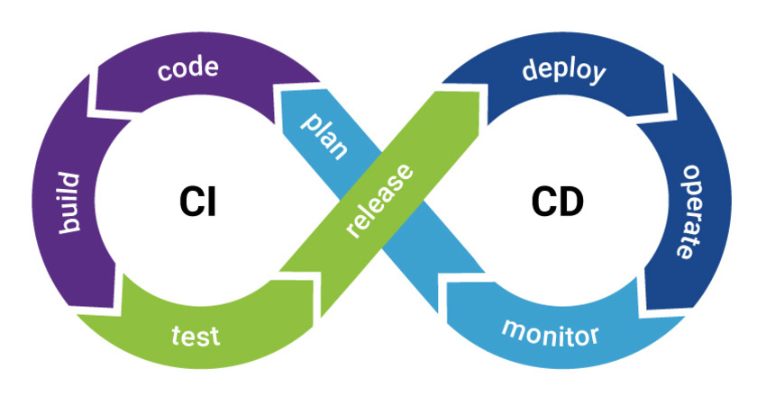

# Lecture 22

## Docker. CI/CD. Cloud Services

### Docker

Docker is a set of platform as a service (PaaS) products that use OS-level virtualization to deliver software in
packages called containers.

Main concepts of Docker:

- Dockerfile
- Image
- Container

#### Dockerfile

**Dockerfile** is a text document that contains all the commands a user could call on the command line to assemble an
image.

Example:

```dockerfile
FROM node:13

WORKDIR /app

COPY package*.json ./

RUN npm install

COPY . /app

ENV PORT=3000

EXPOSE 3000

CMD ['npm', 'start']
```

#### Image

A Docker image is a read-only template that contains a set of instructions for creating a container. It provides a
convenient way to package up applications and preconfigured server environments.

To build an image use `docker build -t <tab>:<version> .` command. Example:

```bash
docker build -t nodeapp:latest .
```

Commands: 
```bash
# list images
docker images
# remove image
docker rmi <image>
# remove all images
docker rmi $(docker images -aq)
```

#### Container

Containers offer a logical packaging mechanism in which applications can be abstracted from the environment in which
they actually run. This decoupling allows container-based applications to be deployed easily and consistently,
regardless of whether the target environment is a private data center, the public cloud, or even a developer’s personal
laptop. This gives developers the ability to create predictable environments that are isolated from the rest of the
applications and can be run anywhere.

To run container from image:

```bash
docker run [OPTIONS] <image>
```

Options:

- `-d` Run container in detached mode.
- `-p` Port forwarding, e.g. `-p 80:3000` forwards connections on port 80 to port 3000 inside the container
- `-v` Creates a mounted volume. `-v <mount_from>:<mount_to>`. *Tip: use ${PWD} to mount current directory.*
- `-e` Set enironment variables  
- `--rm` Remove container and clean data after stop.

Example:

```bash
# - run image called "nodeapp" in detached mode, 
# - forward connections on port 80 to port 3000,
# - mount "./src" directory to "/app/src" inside the container
# - set CUSTOM_ENV_VAR environment variable value as "some_value"
# - container will be removed after it stops
docker run -d -p 80:3000 -v ${PWD}/src:/app/src -e CUSTOM_ENV_VAR="some_value" --rm nodeapp
```

```bash
# list running containers
docker ps
# list all containers
docker ps -a
# start container
docker start <container_id>
# stop container
docker stop <container_id>
```

#### Pushing to registry

```bash
docker tag <image_name>:<version> <remote_repository>:<version>
docker push <remote_repository>:<version>
```

### CI/CD

CI and CD stand for continuous integration and continuous delivery/continuous deployment. CI is a
modern software development practice in which incremental code changes are made frequently and reliably. Automated
build-and-test steps triggered by CI ensure that code changes being merged into the repository are reliable. The code is
then delivered quickly and seamlessly as a part of the CD process. In the software world, the CI/CD pipeline refers to
the automation that enables incremental code changes from developers’ desktops to be delivered quickly and reliably to
production.

CI/CD allows organizations to ship software quickly and efficiently. CI/CD facilitates an effective process for getting
products to market faster than ever before, continuously delivering code into production, and ensuring an ongoing flow
of new features and bug fixes via the most efficient delivery method. 



CI/CD Services:

- AWS CodePipeline
- CircleCI
- Gitlab CI/CD
- TeamCity

### AWS ECS

`buildspec.yml` example:

```yaml
version: 0.2

phases:
  pre_build:
    commands:
      - echo Login to Docker Registry
      - aws ecr get-login-password --region $AWS_REGION | docker login --username AWS --password-stdin $AWS_ACCOUNT_ID.dkr.ecr.$AWS_REGION.amazonaws.com
  build:
    commands:
      - echo Building docker image
      - docker build -t $APP_NAME:$IMAGE_TAG --build-arg PORT --build-arg MESSAGE -f Dockerfile .
      - docker tag $APP_NAME:$IMAGE_TAG $AWS_ACCOUNT_ID.dkr.ecr.$AWS_REGION.amazonaws.com/$APP_NAME:$IMAGE_TAG
      - echo Build completed on `date`
      - echo Docker image built and tagged
  post_build:
    commands:
      - echo Starting post_build stage
      - docker push $AWS_ACCOUNT_ID.dkr.ecr.$AWS_REGION.amazonaws.com/$APP_NAME:$IMAGE_TAG
      - aws ecs update-service --cluster $FARGATE_CLUSTER --service $SERVICE_NAME --force-new-deployment
```