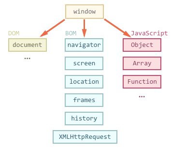
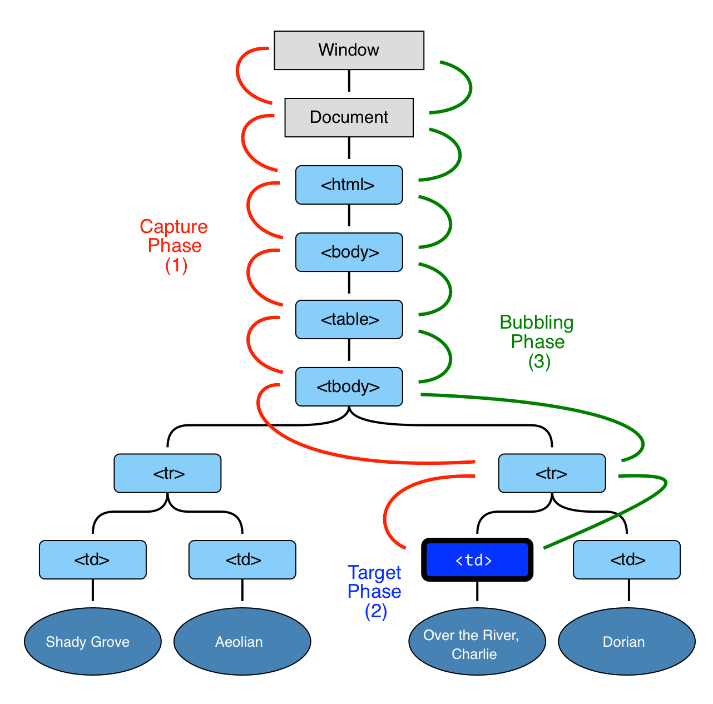

# Lecture 7

### Working with DOM

- Document object model
- Browser object model
- Javascript



###### DOM navigation

**Structure:**

- document.head - `<head>`
- document.body - `<body>`
- document.documentElement - `<html>`

**Childs and parent:**

- parentNode
- childNodes
- firstChild
- lastChild

**Neighborhoods:**

- previousSibling
- nextSibling

###### More about DOM

- [MDN DOM](https://developer.mozilla.org/en-US/docs/Web/API/Document_Object_Model/Introduction)
- [W3.org DOM](https://www.w3.org/TR/DOM-Level-2-Core/introduction.html)

### Events

- `onchange` - An HTML element has been changed
- `onclick` - The user clicks an HTML element
- `onmouseover` - The user moves the mouse over an HTML element
- `onmouseout` - The user moves the mouse away from an HTML element
- `onkeydown` - The user pushes a keyboard key
- `onload` - The browser has finished loading the page
- https://www.w3schools.com/jsref/dom_obj_event.asp
- https://developer.mozilla.org/en-US/docs/Web/Events

The `addEventListener` method is the most preferred way to add an event listener to window, document or any other element in the DOM.
There is one more way called `on` property onclick, onmouseover, and so on. But is not as useful, as it does not allow us to add multiple event listeners on the same element. The other methods allow it.

An event object is passed as an argument (optional) to the handler which contains all the information related to the event

```js
window.addEventListener('mousedown', function (event) {
  alert('window');
  console.log(event);
});
```

- `button`: - As this was the mousedown event, it will tell you the button you clicked. For the mouse, Left, middle, and right correspond to 0, 1, and 2 respectively. If you click the right button, you can see the value 2.

- `clientX and clientY`: - Position relative to the upper left of the content area (Viewport). Just analyze the value of these properties with the place you clicked, and you can see how they’re related. Even if you scroll down the page, these properties remain the same. ScreenX and ScreenY reference from the top left of the screen (Monitor).

- `altkey / ctrlkey`: - If you keep any of these keys pressed while performing your right click operation, then you can see these values are true. Otherwise, they’re false as in our case.

- `target`: - It corresponds to the element you performed the action upon. Whatever element you might have clicked on, you can see the information corresponding to this property in the console

###### Event.preventDefault()

```html
<html>
  <body>
    <a href="https://google.com/">Google</a>
    <script>
      let link = document.querySelector('a'); // It is the method to access the first matched element
      link.addEventListener('click', function (event) {
        console.log('Redirecting Stopped');
        event.preventDefault();
      });
    </script>
  </body>
</html>
```

###### Event bubbling and capturing

```html
<style>
  body * {
    margin: 10px;
    border: 1px solid blue;
  }
</style>

<form onclick="alert('form')">
  FORM
  <div onclick="alert('div')">
    DIV
    <p onclick="alert('p')">P</p>
  </div>
</form>
```



```js
let elems = document.querySelectorAll('form,div,p');

for (let i = 0; i < elems.length; i++) {
  elems[i].addEventListener('click', highlightThis, true); // with capturing
  elems[i].addEventListener('click', highlightThis, false); // without capturing
}
```

###### Event.stopPropagation()

```html
<html>
  <body>
    <p id="demo">Hello Ho<button id="button12">Button2</button></p>
    <script>
      // Event Listener on the Button and it's logic
      document.getElementById('button12').addEventListener('mousedown', function (event) {
        alert('button clicked');
        if (event.button == 2)
          // Right Click
          event.stopPropagation();
      });
      // Event Listener on the paragraph element with it's logic:
      document.getElementById('demo').addEventListener('mousedown', function (event) {
        alert('Paragraph clicked');
      });
    </script>
  </body>
</html>
```

###### Removing an event listener from an element

```js
Document.getElementbyId('id_name').removeEventListener('click', fn_name);
```

###### Event delegation

https://plnkr.co/edit/WJWZclzrDMKT9r2Urmw7?p=preview

###### Event generation

```html
<button id="elem" onclick="alert('Клик');">Автоклик</button>

<script>
  var event = new Event('click');
  elem.dispatchEvent(event);
</script>
```

http://learn.javascript.ru/event-delegation
