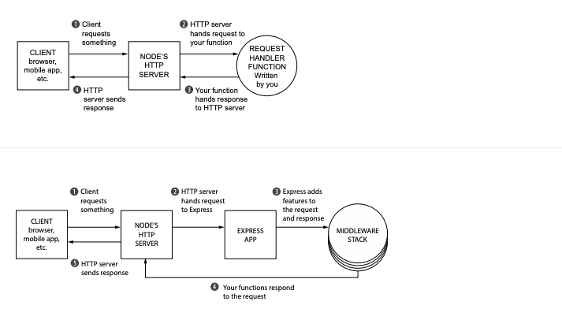

# Lecture 9

## Node.js what is this?

Node.js is an open-source, cross-platform, back-end JavaScript runtime environment that runs on the V8 engine and executes JavaScript code outside a web browser.

## Promise

```js
const user = {
  name: 'Stella',
};

const myPromise = new Promise((resolve, reject) => {
  // request
  setTimeout(() => {
    resolve(user);
  }, 100);
});

console.log(myPromise); // Promise { <pending> }

myPromise.then((res) => {
  console.log(res); // { name: 'Stella' }
});
```

```js
const user = {
  name: 'Stella',
};

const myPromise = new Promise((resolve, reject) => {
  // request
  setTimeout(() => {
    if (Math.round(Math.random()) >= 1) {
      resolve(user);
    } else {
      reject(new Error('Something went wrong'));
    }
  }, 100);
});

console.log(myPromise); // Promise { <pending> }

myPromise
  .then((res) => {
    const newUser = { ...res };
    newUser.age = 23;
    return newUser;
  })
  .then((res) => {
    console.log(res); // { name: 'Stella', age: 23 }
  })
  .catch((err) => {
    console.log(err); // Error
  })
  .finally(() => {
    console.log('end');
  });
```

```js
const user = {
  name: 'Stella',
};

const myPromise = new Promise((resolve, reject) => {
  // request
  setTimeout(() => {
    if (Math.round(Math.random()) >= 1) {
      resolve(user);
    } else {
      reject(new Error('Something went wrong'));
    }
  }, 100);
});

console.log(myPromise); // Promise { <pending> }

myPromise
  .then((res) => {
    const newUser = { ...res };
    newUser.age = 23;
    return new Promise((resolve, reject) => {
      setTimeout(() => {
        if (Math.round(Math.random()) >= 1) {
          resolve({ name: 'Zlata', age: 18 });
        } else {
          reject(new Error('Wrong second promise'));
        }
      });
    });
  })
  .then((res) => {
    console.log(res);
  })
  .catch((err) => {
    console.log(err); // Error
  })
  .finally(() => {
    console.log('end');
  });
```

```js
const user1 = {
  name: 'Stella',
};
const user2 = {
  name: 'Zlata',
};

const myPromise1 = new Promise((resolve, reject) => {
  // request
  setTimeout(() => {
    if (Math.round(Math.random()) >= 1) {
      resolve(user1);
    } else {
      reject(new Error('Something went wrong 1'));
    }
  }, 100);
});

const myPromise2 = new Promise((resolve, reject) => {
  // request
  setTimeout(() => {
    if (Math.round(Math.random()) >= 1) {
      resolve(user2);
    } else {
      reject(new Error('Something went wrong 2'));
    }
  }, 100);
});

const all = Promise.all([myPromise1, myPromise2]);
const allSettled = Promise.allSettled([myPromise1, myPromise2]);

all
  .then((res) => {
    console.log(res); // [ { name: 'Stella' }, { name: 'Zlata' } ]
  })
  .catch((err) => {
    console.log(err);
  });

allSettled.then((res) => {
  console.log(res);
  /*
    [
      { status: 'fulfilled', value: { name: 'Stella' } },
      {
        status: 'rejected',
        reason: Error: Something went wrong 2
            at Timeout._onTimeout (/home/illia/DB2/lectures/9/index.js:25:14)
            at listOnTimeout (internal/timers.js:554:17)
            at processTimers (internal/timers.js:497:7)
      }
    ]
    */
});
// catch doesn't exist
```

```js
const user = {
  name: 'Stella',
};
function myFunction() {
  return user;
}

async function myAsyncFunction() {
  return user;
}

console.table(myFunction()); // { name: 'Stella' }
console.log(myAsyncFunction()); // Promise { { name: 'Stella' } }
```

```js
const user = {
  name: 'Stella',
};
function myFunction() {
  return user;
}

async function myAsyncFunction() {
  return user;
}

async function main() {
  const stella = myFunction(); // { name: 'Stella' }
  await myAsyncFunction().then((r) => console.log(r));
  console.log('ss');
}

main();
```

```js
function* generateSequence() {
  yield 1;
  yield 2;
  return 3;
}

let generator = generateSequence();

let one = generator.next();

console.log(one); // {value: 1, done: false}

one = generator.next();
one = generator.next();
console.log(one); // {value: 3, done: true}
```

## ENV

```bash
export STELLA=ZLATA
```

```js
console.log(process.env.STELLA);
```

## FS

### Read File

```js
const fs = require('fs');

fs.readFile('data.json', 'utf-8', (err, content) => {
  console.log(content, 1);
});

const content = fs.readFileSync('data.json', 'utf-8');
console.log(content, 2);
```

### Write File

```js
const fs = require('fs');

fs.writeFile('data2.json', JSON.stringify({ name: 'Stella' }), (err) => {
  console.log(err); // null
});

fs.writeFileSync('data3.json', JSON.stringify({ name: 'Zlata' }));
```

```js
const fs = require('fs');

fs.appendFile('data2.json', JSON.stringify({ name: 'Stella' }), (err) => {
  console.log(err); // null
});

fs.appendFileSync('data3.json', JSON.stringify({ name: 'Zlata' }));
```

```js
const fs = require('fs');

let readStream = fs.createReadStream('data3.json');

readStream.on('open', () => {
  // console.log(chunk);
});

readStream.on('data', (data) => {
  console.log(data); // <Buffer>
  console.log(data.toString()); // content
});

readStream.on('error', (err) => {
  res.end(err);
});
```

## Event Loop


```js
console.log(1); // 1

setTimeout(() => {
  console.log(2); // 3
}, 3000);

console.log(3); // 2
```

```js
console.log(1); // 1

setTimeout(() => {
  console.log(3); // 3
});

console.log(5); // 2
```

```js
console.log(1); // 1

setTimeout(() => {
  console.log(3); // 4
});

process.nextTick(() => {
  console.log('I am nextTick'); // 3
});

console.log(5); // 2
```

```js
console.log(1); // 1

setTimeout(() => {
  console.log(3); // 5
});

process.nextTick(() => {
  console.log('I am nextTick'); // 3
});

const myPromise = new Promise((resolve, reject) => {
  resolve({ i: 'Promise' });
});

myPromise.then((res) => {
  console.log(res);
}); // 4

console.log(5); // 2
```

```js
const fs = require('fs');
const myPromise = new Promise((resolve, reject) => {
  // request
  resolve({
    user: {
      name: 'Stella',
    },
  });
});

myPromise.then((res) => {
  fs.writeFile('data.json', JSON.stringify(res), (err) => {
    console.log(err);
  });
  // const content = fs.readFileSync('data.json');
  // console.log(content);
});
```

# Node.js Frameworks

- Express
- Koa
- Nest
- Hapi
- Adonis
- Sails
- ...

## Koa

```js
const Koa = require('koa');
const app = new Koa();

app.use(async (ctx) => {
  ctx.body = 'Hello world!';
});

app.listen(3000);
```

### Middlewares

Middleware - request and response handler function.



Express

```js
async function(request, response, next) {
  // ...
  await next();
}
```

Koa

```js
async function(ctx, next) {
  // ...
  await next();
}
```

## Application

App js

```js
const Koa = require('koa');
const path = require('path');
const Router = require('koa-router');
const views = require('koa-views');
const serve = require('koa-static');
const globalRouter = require('./src/router');

const app = new Koa();

const router = new Router();

const port = process.env.PORT || 3000;

const render = views(path.join(__dirname, '/src/templates'), {
  extension: 'njk',
  map: {
    njk: 'nunjucks',
  },
});

app.use(render);
app.use(serve(path.join(__dirname, '/src/public')));
router.use('/', globalRouter.router.routes());

app.use(router.routes());

app.listen(port, () => {
  console.log(`Server running on port ${port}`);
});
```

router.js

```js
const Router = require('koa-router');

const router = new Router();
const controllers = require('./controller');

router.get('home', controllers.profile);

module.exports = {
  router,
};
```

controller.js

```js
async function profile(ctx) {
  await ctx.render('index', {
    name: 'Stella',
  });
}

module.exports = {
  profile,
};
```

HINT setting for PUG
npm i pug.

```js
const render = views(path.join(__dirname, '/src/templates'), {
  extension: 'pug',
  map: {
    pug: 'pug',
  },
});
```

## References

- promise [link](https://learn.javascript.ru/promise)
- node (fs etc) [link](https://metanit.com/web/nodejs/1.1.php)
- node event loop [link-1](https://flaviocopes.com/node-event-loop/) [link-2](https://nodejs.org/es/docs/guides/event-loop-timers-and-nexttick/)
